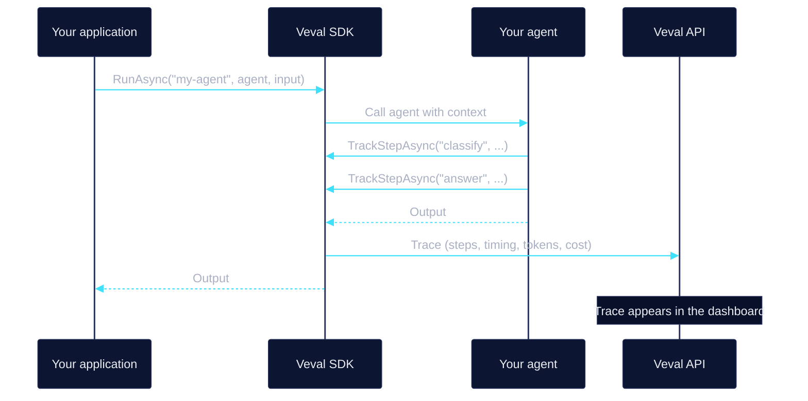

Veval sits around your agent. The SDK records what the agent does on every run, and the same recordings become test fixtures you replay in CI.

## Architecture

Your application calls `RunAsync` with an agent name and a callback. The SDK passes your agent a [context](/guides/tracing#vevalexecutioncontext). Each LLM call or sub-operation your agent wraps in `TrackStepAsync` becomes a [step](/concepts/steps). When the run finishes, the SDK ships the [trace](/concepts/traces) to Veval and returns your agent's output. If your agent throws, the SDK ships the trace with an error status and rethrows the exception.

Traces are ingested asynchronously. A trace can take a moment to show up in the dashboard and the API.

## Recording

<Steps>
  <Step title="Wrap the run">
    `RunAsync` starts a trace, runs your agent, and records the input and output.
  </Step>

  <Step title="Track steps">
    `TrackStepAsync` records a step's input, output, and duration. Use the step handle to attach the model, token counts, and cost.
  </Step>

  <Step title="Ship the trace">
    The SDK sends the trace to Veval. It appears in your dashboard with full step detail, with nested steps shown as a tree.
  </Step>
</Steps>

## Testing

A recorded trace holds the output of every step. That's what makes it testable.

`VevalTestSdk` is a test double for the SDK. Load a trace with `WithReplay` and your agent runs normally, except that each `TrackStepAsync` call returns the recorded output instead of calling the LLM. See [Replay](/concepts/replay).

After a run, [assertions](/concepts/assertions) check the result: no errors, cost under a limit, a step or tool call present, an output graded by an LLM judge. A [snapshot](/concepts/snapshots) compares the run against a stored known-good baseline and reports what changed.

[Scenarios](/concepts/scenarios) group these into a named set of test cases. Each scenario run posts pass/fail results to the dashboard so you can track quality over time.

## Replay is strict

If your agent calls `TrackStepAsync` with a step name that isn't in the recorded trace, `VevalTestSdk` throws. It never falls through to the live LLM. New LLM calls fail the test instead of quietly costing money.

## Next steps

<CardGroup cols={2}>
  <Card title="Quickstart" icon="rocket" href="/quickstart">
    Install the SDK and send your first trace.
  </Card>

  <Card title="Concepts" icon="compass" href="/concepts/overview">
    Traces, steps, scenarios, assertions, replay, and snapshots.
  </Card>

  <Card title="Instrument your agent" icon="wave-pulse" href="/guides/tracing">
    Record steps, metadata, and nested steps.
  </Card>

  <Card title="Test with replay" icon="rotate-left" href="/guides/replay">
    Run your agent against recorded traces in tests.
  </Card>
</CardGroup>
